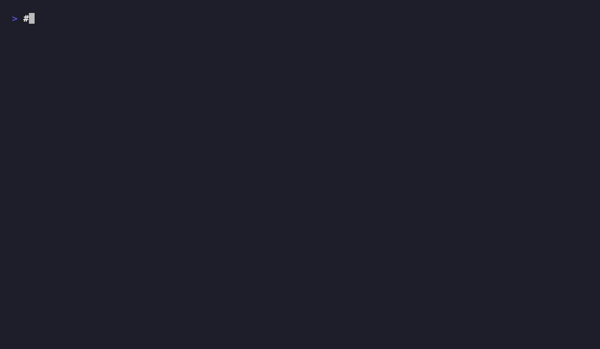

# Lachesis Security Scan

**Find the endpoint that forgot the authorization check, the one its sibling remembered.**

A GitHub Action that builds a compiler-precise code property graph of your repo,
traces untrusted input to dangerous sinks, and reports what it finds straight into
**GitHub code scanning**: inline on the PR, no bot comments, no hosted service.
Everything runs on your own runner.

[](https://github.com/marketplace/actions/lachesis-security-scan)
[](./LICENSE)

Security reporting guidance is in [`SECURITY.md`](./SECURITY.md). Contributor and
local-gate guidance is in [`CONTRIBUTING.md`](./CONTRIBUTING.md).

For local development and CI, run the same dependency-free gate with `make check`.

---

## Why it's different

Most scanners pattern-match one function at a time. Lachesis reasons about your code
as a graph, so it can see something a line-by-line tool can't: **two functions that
reach the same sink, where one authorizes the caller and one doesn't.**

That guard differential is the classic missing-authorization bug. `getInvoice`
checks the session, `getDocument` forgot to, and it's exactly the finding Lachesis
ranks as an `error`:

> **Untrusted input reaches a sink with no authorization check, while a sibling
> function guards the identical sink.**

<!-- Render demo/demo.tape with `vhs demo/demo.tape` and commit demo/demo.gif, then: -->


## See it find the bug

Three commands: build the graph, ask for the overview, then look at the handler
that forgot the check.

```console
$ lachesis-analyze ./project graph.kuzu --prune --incremental
   building code graph... done

$ lachesis-query graph.kuzu overview --format text | grep -i 'guard differential'
Guard differentials: 1

$ lachesis-query graph.kuzu handler-security getDocument --format text
handler: getDocument
status: UNGUARDED
differential_siblings: ["getInvoice"]
  getInvoice guards the identical sink; getDocument does not.
```

The Action runs exactly this on every PR and reports the `UNGUARDED` sibling into
code scanning as an `error`.

## Quickstart

Add `.github/workflows/lachesis.yml` to your repo:

```yaml
name: lachesis
on:
  pull_request:
  push:
    branches: [main]

jobs:
  scan:
    runs-on: ubuntu-latest
    permissions:
      contents: read
      security-events: write   # required to upload SARIF to code scanning
    steps:
      - uses: actions/checkout@11d5960a326750d5838078e36cf38b85af677262 # v4
      - uses: UnboundCompute/lachesis-action@51d7593825790ab01aa65887b0ad67d2366f306c # v1.0.0
        with:
          source: "."
```

Open a PR and the findings appear under **Security > Code scanning**. Merge to
`main` once to establish the baseline, and future PRs get inline annotations on the
lines they change.

## What you get

Each tainted source-to-sink path becomes one code-scanning result, anchored at the
sink, carrying the full data-flow as a navigable code flow, and leveled by guard status:

| Level | Rule | Meaning |
|---|---|---|
| 🔴 `error` | `lachesis/unguarded-sink-differential` | Unguarded sink **and** a sibling guards the identical sink: a guard differential. |
| 🟡 `warning` | `lachesis/unguarded-sink` | Untrusted input reaches a sink with no authorization check on the path. |
| ⚪ `note` | `lachesis/guarded-sink` | The path reaches a sink but passes an authorization check. |

Findings are **leads, not verdicts**: high-signal places to look first, not confirmed vulns.

Languages: **Python, TypeScript/JavaScript, and C.**

## Inputs

| Input | Default | Notes |
|---|---|---|
| `source` | `.` | Directory to analyze. |
| `python-version` | `3.11` | Python runtime for the engine. Override only with a version tested against the Lachesis/Kùzu dependency set. |
| `kuzu-buffer-pool-size` | `1073741824` | Kùzu buffer-pool ceiling in bytes. Raise it for very large trees; lower it on constrained runners. |
| `exclude` | `` | Drop findings under these paths/globs (e.g. a `fixtures` or `vendor` dir). |
| `changed-files` | `` | If set, only report findings in these files. |
| `analyze-args` | `--prune --incremental` | Flags for the graph build. |
| `c-jobs` | empty (adaptive) | Optional Clang frontend concurrency override; use `1` to cap memory or `2` for a measured medium-tree runner. |
| `frontend-timeout` | `300` | Maximum seconds for one Lachesis frontend invocation. |
| `query-timeout` | `300` | Maximum seconds for one SARIF graph query. |
| `build-timeout` | `1800` | Maximum seconds for the complete graph build. |
| `lachesis-ref` | `main` | Branch/tag/SHA of the Lachesis engine to install. Pin for reproducibility. |
| `atropos-repo` | `https://github.com/UnboundCompute/atropos` | Atropos catalog repository to load. |
| `atropos-ref` | `main` | Branch/tag/SHA of Atropos. Pin a tag or commit for reproducible findings. |
| `fail-on` | `none` | Fail the check at `note` / `warning` / `error` and above. Other values fail configuration validation. |
| `upload` | `true` | Upload SARIF to code scanning. |
| `sarif-file` | `lachesis.sarif` | Output path. |

The Action validates its resource limits, output path, boolean/threshold values, and
quoted analyzer arguments before cloning or installing anything. Invalid configuration
fails with exit code 2 and an actionable message, so a misconfigured workflow does not
spend runner time on a partial scan.

Dependency installation is noninteractive and uses a 60-second pip network timeout;
credential prompts and pip's version-check request cannot leave a runner waiting.

## Reproducible production use

Pin `lachesis-ref` to an immutable Lachesis release tag or commit SHA in production
workflows. The default `main` ref is intended for development and follows engine
changes. The Action itself is released under its own `v1` tag; release verification and
rollback guidance are in [`RELEASING.md`](./RELEASING.md).

## How it works

1. Installs the [Lachesis engine](https://github.com/UnboundCompute/lachesis) (uses a blob-filtered checkout, then vendors its TypeScript frontend; pure Python, no `npm`).
2. Installs and validates the [Atropos catalog](https://github.com/UnboundCompute/atropos) from a blob-filtered checkout,
   exporting `ATROPOS_ROOT` so model binding is explicit rather than dependent on a
   sibling checkout.
3. Restores the incremental frontend bundles when the source, lockfiles, engine, and catalog refs match, then
   builds a light pruned graph; the data-flow tier folds lazily. The cache is only a
   compile reuse hint: Lachesis still validates file digests and output-affecting flags.
4. Traces every source-to-sink path, classifies its guard status, and renders SARIF.
5. Uploads to GitHub code scanning.

No code leaves your runner. No account. No API key.

## Add the badge to your repo

Show your project runs Lachesis:

```markdown
[](https://github.com/UnboundCompute/lachesis-action)
```

## License

[MIT](./LICENSE). The Action runs in your CI and does not link into or relicense
your code. (The Lachesis engine it installs is separately licensed.)
